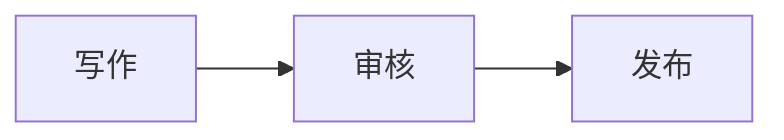

# Kakozane Blog

个人博客 Monorepo：`api/` 是 Go/Gin 接口，`web/` 是 React Router SSR 前台，`admin/` 是 React + Ant Design Pro 风格后台。前端统一使用 pnpm 和严格 TypeScript；API 统一以 `/api/v1` 开头。

## 功能

| 区域 | 已实现 |
| --- | --- |
| 前台 | SSR 首页（公开内容统计、站长近况、发布/公开评论/匿名点赞混排的最近动态、过去一年发布足迹与风向标）、可搜索、排序并切换摘要/紧凑视图的文章列表及时间归档、文章/手记/思考详情、手记专栏与精选手记、一言摘录墙、可独立发布的 Markdown 页面、Markdown 代码高亮/公式/提示块/Mermaid 图表/目录/阅读进度、可配置的自定义导航与更多内容入口、快捷搜索面板与完整搜索页（覆盖公开文章、手记、思考和页面）、新内容实时提醒、话题索引与分类/标签、友情链接、项目展示、分页、全站/手记/思考/一言 RSS 与订阅页、站点地图、首页和内容详情的结构化数据、浅色/深色主题。 |
| 读者 | 注册、登录、退出、修改昵称和密码、文章/手记/思考点赞与个人喜欢列表、评论与回复；新评论需审核。 |
| 后台 | 文章与手记的草稿、含代码高亮/公式/Mermaid 图表的 Markdown 预览与发布、文章/手记/自定义页面未保存内容的前台排版预览、自定义页面的草稿和发布、编辑时离开提醒与本地草稿恢复、首页文章置顶与精选手记、思考快速编辑、一言编辑与公开控制、分类、标签、用户、评论审核及一级评论置顶、图片媒体库、友情链接、项目管理、站点设置（含自定义导航、浏览器图标与限时站长近况）、个人资料。 |
| 后端 | MySQL、Redis 会话/限流/发布通知、Argon2id 密码哈希、自动迁移、路由/处理器/服务/仓库分层与手动依赖注入。 |

## 文件与目录

| 路径 | 作用 |
| --- | --- |
| `README.md`、`LICENSE`、`.gitignore` | 项目说明、MIT 许可证和 Git 忽略规则。 |
| `.dockerignore`、`Dockerfile.proxy` | 代理镜像构建排除规则；构建后台并打包 Caddy。 |
| `compose.yaml`、`Caddyfile` | 本地正式镜像编排及 6324/6325/6326 HTTPS 代理。 |
| `compose.dev.yaml`、`Caddyfile.dev` | 开发模式源码同步、Vite 热更新、Go 自动重启及 HTTPS 代理。 |
| `compose.prod.yaml`、`Caddyfile.prod` | 线上独立编排、域名 HTTPS 和 80/443 代理。 |
| `api/config.example.yaml`、`api/config.yaml` | 后端配置模板及实际配置；实际文件不入库。 |
| `api/cmd/server/main.go`、`cmd/bootstrap/main.go` | 启动、探活、迁移、组装依赖；首次创建管理员。 |
| `api/internal/config/`、`password/` | 配置校验、Argon2id 密码处理及测试。 |
| `api/internal/router/`、`handler/` | 版本化路由；HTTP 请求、响应、Cookie 和错误处理。 |
| `api/internal/service/`、`repository/` | 业务规则；MySQL/Redis 查询与图片存储。 |
| `api/internal/model/`、`api/migrations/` | 数据类型；带版本记录的建表 SQL。 |
| `api/Dockerfile`、`go.mod`、`go.sum` | API 镜像、依赖与校验和。 |
| `web/app/routes.ts`、`app/routes/` | 前台页面路由：首页、文章列表与详情、手记及专栏、思考、一言、自定义页面、时间线、话题及分类和标签、归档、搜索、订阅、友链、项目、关于、登录、注册和账号。 |
| `web/app/root.tsx`、`app/app.css` | HTML 根布局、站点数据和前台样式。 |
| `web/public/favicon.svg` | 前台浏览器标签图标的默认 Kakozane 标识；后台可改为自定义图标地址。 |
| `web/DESIGN.md` | 前台视觉规范与组件取舍。 |
| `web/app/components/`、`lib/`、`types/` | 组件、服务端和浏览器端请求、TypeScript 类型。 |
| `web/react-router.config.ts`、`vite.config.ts`、`Dockerfile` | SSR、开发构建配置和 Node 镜像。 |
| `admin/src/router/`、`layout/`、`pages/` | 登录保护、ProLayout 菜单及按路由加载的管理页面。 |
| `admin/src/api/`、`types/` | 后台请求函数和模块化 TypeScript 类型。 |
| `admin/src/hooks/useDraftBackup.ts`、`lib/local-draft.ts` | 编辑器本地草稿自动备份与恢复，按管理员及内容 ID 隔离。 |
| `admin/src/main.tsx`、`App.tsx`、`index.css` | React 入口、根组件和后台基础样式。 |
| 两个前端的 `package.json`、`pnpm-lock.yaml`、`tsconfig*.json` | 脚本、依赖锁定版本和类型检查配置。 |

配置放在 `api/`，因为数据库密码仅由后端读取。Git 与 Docker 构建上下文会排除 `api/config.yaml`、`api/bootstrap-admin.txt`、依赖和构建产物。

## 本地运行

需要 Docker Desktop，以及已运行并映射至宿主机 3306/6379 的 MySQL/Redis。首次执行 bootstrap 还需要本机 Go 1.26。**本项目不会重复创建这两个容器**。其他机器首次运行时，先创建 `kakozane_blog` 数据库和专用账号：

```bash
cp api/config.example.yaml api/config.yaml
# 编辑 api/config.yaml，填入博客数据库账号与密码
cd api && go run ./cmd/bootstrap && cd ..
docker compose -f compose.dev.yaml up --build --watch
```

当前机器已初始化，无需再运行 bootstrap；重复运行也不会重置管理员密码。初始密码在 `api/bootstrap-admin.txt`，权限为 600，登录后请修改。API 启动时会自动应用未执行的 `api/migrations/*.sql`。`--watch` 保持运行期间，保存业务源码即可更新，不必反复执行 Compose。生产镜像的本地验证才使用 `docker compose up --build -d`。

| 地址 | 用途 |
| --- | --- |
| <https://localhost:6325/> | 博客前台。 |
| <https://localhost:6326/> | 管理后台。 |
| <https://localhost:6324/api/v1/health> | API 探活。 |

本地 Caddy 使用自己的 CA。如需浏览器信任，执行 `docker compose cp proxy:/data/caddy/pki/authorities/local/root.crt ./local-ca.crt`，然后由你自己将公共证书导入 macOS Keychain Access 的 `login` 钥匙串并设为信任。可用 `curl --cacert local-ca.crt https://localhost:6324/api/v1/health` 验证。`local-ca.crt` 不入库，CA 私钥仅在 Docker 卷中。`docker compose down` 不会停止已有数据库；不要随意加 `-v`，它会删除图片与证书卷。

## 开发与检查

首次进入开发模式运行下面的命令，并保持终端打开。它会构建开发镜像并监视文件：

```bash
docker compose -f compose.dev.yaml up --build --watch
```

以后每天启动只需运行 `docker compose -f compose.dev.yaml up --watch`，无需每次加 `--build`。保持它运行，保存 `web/`、`admin/` 中的 React、CSS 等源码后，Compose 会同步文件，Vite 会热更新；部分 SSR 路由修改会刷新页面。保存 `api/` 中的 Go 源码后，Compose 会同步文件并自动重新编译、重启 API。**改完业务代码不用再执行 Compose 命令。**浏览器仍访问上面的三个 `https://localhost` 地址，登录与 Cookie 正常工作。Watch 停止后容器可能继续运行，但源码不再自动同步；重新运行 `up --watch` 即可。

新增前台路由时，先创建路由组件文件，再修改 `web/app/routes.ts`。如果 Vite 恰好在新文件同步前重载配置并显示“文件不存在”，运行 `docker compose -f compose.dev.yaml restart web` 即可恢复，无需重建镜像。构建检查请使用下方宿主机 `corepack pnpm build` 命令；不要在正在运行 `pnpm dev` 的前台容器内同时构建，以免构建产物干扰开发服务器的样式缓存。

修改 `go.mod`、`go.sum` 或前端依赖文件时，Watch 会自动重建对应镜像；修改 Dockerfile 或 Compose 配置后，停止 Watch，再运行带 `--build --watch` 的首次启动命令。修改 `Caddyfile.dev` 后运行 `docker compose -f compose.dev.yaml restart proxy`；修改 `api/config.yaml` 后运行 `docker compose -f compose.dev.yaml restart api`。结束开发按 `Ctrl+C`；需要清理应用容器时才运行 `docker compose -f compose.dev.yaml down`。要切回正式镜像，运行 `docker compose up --build -d`。不要使用 `down -v`，它会删除上传图片与本地 HTTPS 证书卷。

如果只想用宿主机终端调试，仍可分别运行 `cd api && go run ./cmd/server`、`cd web && corepack pnpm dev`、`cd admin && corepack pnpm dev`；这些 HTTP 直连地址不适合测试当前的 HTTPS 登录流程。

```bash
cd api && go test ./...
cd ../web && corepack pnpm typecheck && corepack pnpm build && node --test app/lib/*.test.mjs
cd ../admin && corepack pnpm lint && corepack pnpm build
cd .. && docker compose config -q && docker compose -f compose.prod.yaml config -q
```

## 接口与登录

前后台共用 `users` 表，但登录接口、会话和 Cookie 独立。读者只可登录前台，管理员可登录两端。前台个人信息只返回账号与昵称，后台管理员信息才包含身份和权限。密码经 HTTPS 传输，数据库只存 Argon2id 哈希；Redis 存随机会话令牌的 SHA-256 摘要。Cookie 使用 `Secure`、`HttpOnly`、`SameSite=Strict`。修改密码、停用用户或改变身份会令旧会话失效；项目不使用 JWT 签名密钥。

读者从文章、手记或思考进入登录页后，登录成功会回到原内容；从评论区进入会回到评论位置。切换到注册页时也会保留返回地址。返回地址只接受站内路径，防止登录后跳转到外部网站。

| 用途 | 主要接口 |
| --- | --- |
| 前台账号 | `POST /api/v1/auth/register`、`login`、`logout`、`change-password`；`GET /api/v1/auth/me`；`PUT /api/v1/auth/profile`。 |
| 公开内容 | `GET /api/v1/posts`、`notes`、`thinking` 及各自的 `:slug`、`:slug/related`；`notes/series`、`says`、`pages`、`pages/:slug`、`timeline`、`timeline/years`、`timeline/months`、`activity/comments`、`activity/likes`、`friends`、`projects`、`events`（SSE）、`categories`、`tags`、`site`、`site/stats`；`GET /sitemap.xml`、`feed.xml`、`notes/feed.xml`、`thinking/feed.xml`、`says/feed.xml`、`robots.txt`。 |
| 评论与点赞 | `GET /api/v1/posts/:slug/comments`、`likes`，手记与思考分别改用 `notes/:slug/...`、`thinking/:slug/...`；登录后可提交评论或回复、读取 `comments/mine`、修改本人待审评论，以及 `PUT` 点赞、`DELETE` 取消点赞；`GET /api/v1/auth/likes` 分页返回当前读者喜欢的公开内容。回复显示被回复者名称；公开评论可通过 `comments/:id/location` 定位当前页。 |
| 后台账号 | `POST /api/v1/admin/auth/login`、`logout`、`change-password`；`GET /api/v1/admin/auth/me`；`PUT /api/v1/admin/auth/profile`。 |
| 后台管理 | `/api/v1/admin/posts`、`categories`、`tags`、`users`、`comments`（含 `:id/pin`）、`media`、`friends`、`projects`、`pages`、`says`、`site`。 |

公开注册固定为 `reader` 身份，并按 IP 限制频率；评论默认待审核。登录用户可在对应内容下查看自己的待审或未通过评论，并在提交后 10 分钟内修改；服务端同时核对评论作者、所属内容和状态，修改后重新待审核。评论支持粗体、链接、列表、引用、代码等 Markdown 格式，提交前可预览，也可通过每条公开评论的固定链接定位；外链带 `nofollow ugc`，评论图片只显示替代文字，不加载远程图片。图片限 JPEG、PNG、GIF、WebP 和 5 MiB。公开文章列表只显示已发布内容，草稿仅在后台可见。

登录读者在 `/account` 可分页回看自己点过赞且仍公开的文章、手记和思考；私人列表按点赞时间排序，接口与账号页面均禁止缓存。内容撤回后不会出现在列表中。

前台页面打开时通过 SSE 接收新发布的文章、手记或思考提醒；后台保存站点设置后，已打开的前台页面也会刷新站点信息，站长近况到期时会自动隐藏。关闭页面后不会发送系统推送通知。三类内容都可分享；支持原生分享的浏览器会调出系统分享面板，否则复制链接。首页、公开栏目及内容详情的 SSR 页面会输出规范链接和 Open Graph 信息；分页栏目各自使用对应页码的规范链接，文章封面或站点头像用于分享预览。思考是独立的短内容，后台无需填写标题，正文最多 2000 字；手记保留标题和完整的 Markdown 编辑器。内容页可切换正文字体与三级字号，选择保存在当前浏览器。

首页最近动态按时间混排已发布内容、已通过审核的评论与匿名点赞。评论和点赞只在所属内容仍公开时出现；待审核、未通过以及草稿下的评论不会进入公开接口。点赞动态不返回点赞者身份。评论链接按评论 ID 定位，打开时计算当前分页并跳到原评论；站长置顶或取消置顶后仍能定位。

内容详情的“上一篇 / 下一篇”按发布时间连接同类型的已发布内容；同一时间按 ID 排序，不会串入草稿或其他栏目。“继续阅读”优先展示同标签、同分类的已发布内容；不足三篇时以最近发布的同类型内容补齐，不会显示当前内容或草稿。文章与手记按 Markdown 可见文字估算字数及阅读时间；内容发布后再编辑会显示更新时间。文章超过 180 天未更新时会在正文前提示读者核对新资料。长内容的阅读位置只保存在当前浏览器，重访时可选择继续；正文更新后旧位置失效，接近读完时自动清除；阅读超过 10% 后可一键返回顶部。详情页可切换默认字体与系统衬线字体，选择仅保存在当前浏览器。文章与手记可开启沉浸阅读，暂时收起导航和正文之外的操作，按 Esc 或固定按钮即可退出。宽屏内容页在正文右侧提供点赞、评论、分享和订阅快捷操作，窄屏保留正文末尾的按钮。正文中独占一行的 Markdown 图片可点击查看大图，并以替代文本作图片说明；按 Esc、关闭按钮或点击弹窗外侧可退出。带链接的图片保留原来的跳转行为。

有二、三级标题的内容在桌面显示页内目录，在小屏显示固定的“目录”入口；点击章节可跳转，按 Esc 可关闭小屏目录。标题旁的 `#` 可打开该章节的固定链接。

后台编辑手记时可选择“专栏”：它使用现有分类项，一篇手记可属于一个专栏。只有包含已发布手记的分类会出现在 `/notes/series`；点进专栏可分页阅读，文章分类不会单独出现在手记专栏里。

`/topics` 汇总有已发布内容的分类与标签，可从页头或页脚进入。文章分类和内容标签有独立的 `/categories/:slug`、`/tags/:slug` 页面，按发布时间列出该主题下已公开的文章、手记和思考，并支持分页；详情页的分类与标签链接可直达这些页面。手记详情的分类链接仍指向只包含手记的专栏。
公开分类与标签列表只包含已发布内容使用过的条目；后台 `/api/v1/admin/categories`、`/api/v1/admin/tags` 仍会显示草稿使用和暂未使用的条目。站点地图收录有公开内容的分类、标签和手记专栏。

后台文章编辑页可选择“置顶首页”。置顶只影响首页文章列表，归档、时间线和 RSS 仍按发布时间排序；草稿不会在公开列表中出现。

后台手记编辑页可标为“精选手记”。精选标记不改变手记的时间顺序；读者可在 `/notes?featured=1` 和 `/timeline?featured=1` 只看已发布的精选手记，年份与分页筛选会保留此条件。草稿不会在公开精选列表中出现。

后台文章、手记和自定义页面编辑器会把未保存的表单内容暂存在当前浏览器的 localStorage。异常关闭或刷新后重新打开同一编辑页会提示恢复；恢复后仍需手动保存到服务器。服务器内容更新时会提醒确认。成功保存或在离开提醒中明确选择“放弃修改”会清除本地备份；清除浏览器站点数据也会删除备份。同一内容同时在多个标签页编辑时，最后一次本地备份胜出。

后台“自定义页面”可以维护不属于文章栏目的固定内容，例如使用清单；草稿仅在后台可见，发布后通过 `/pages/:slug` 的 SSR 页面展示，并收录进站点地图。公开页面列表在 `/pages`。正文与文章共用 Markdown 渲染，支持代码高亮、公式、提示块、章节目录与图片大图；“关于”页和后台预览也沿用同一渲染方式。

访问不存在的内容会显示与前台一致的 404 页面，可返回首页或搜索；暂时无法读取页面时提供重新加载入口。

需要把某个页面放进导航时，在后台“站点设置 → 自定义导航”填写名称和 `/pages/:slug` 地址；最多 5 条，也支持 HTTPS 外链。它们出现在桌面“更多”和手机菜单中，外链会在新标签打开。不安全地址和重复链接会被拒绝。

编辑文章、手记或自定义页面时，可在正文输入框下直接上传图片并插入 Markdown 链接；上传期间不能保存或放弃编辑。修改后切换后台页面会先提示继续编辑或放弃修改；刷新和关闭标签页也会触发浏览器的未保存提示。保存成功后正常返回列表。退出后台会在确认离开编辑器之后注销会话。

编辑文章、手记或自定义页面时点击“前台预览”，会在新标签页展示当前表单的标题、摘要、封面（若有）和 Markdown 正文，采用前台排版。预览内容仅通过浏览器窗口消息传递，不会保存到数据库，也不会放进网址；`/preview` 禁止搜索引擎收录。刷新预览页后，需从编辑器再次打开。

搜索会匹配已发布文章、手记、思考和自定义页面的标题、摘要及正文；草稿和撤回的内容不在结果中。搜索词中的 `%`、`_` 按普通文字处理。当前用 MySQL `LIKE` 扫描正文，内容规模或访问量明显增长时再考虑全文索引。

页头搜索按钮或 ⌘K / Ctrl+K 可打开快捷搜索面板，输入时展示最近的 8 条匹配内容；方向键可选择结果并按 Enter 打开。焦点留在输入框时按 Enter，或点击“查看全部结果”，会进入 `/search` 完整结果页；Esc 关闭面板。

首页发布足迹按月统计过去一年已公开的文章、手记和思考；只有一个月份有内容时先显示简短统计，出现跨月份内容后再显示月度图表。点击有内容的月份会打开对应月份的时间线，类型筛选和分页会保留月份条件。

后台“站点设置”可填写站长近况的表情与文字，前台首页在简介下方展示；可设置到期时间，到期后的请求会自动隐藏近况。两项都留空会清除近况。
修改博客名称后，前台各页面的浏览器标题也会使用新名称；公开站点地址仍单独决定 RSS、站点地图与内容固定链接中的域名。

「一言」是独立于思考的摘录：正文最多 1000 字，可选出处和作者，后台可隐藏；前台使用双栏摘录墙并提供独立 RSS。它不参与文章时间线，也没有评论和点赞。

`/subscribe` 集中列出全站、手记、思考和一言四个 RSS 地址，可直接打开或复制到阅读器。全站源包含文章、手记与思考；一言使用独立源。RSS 无需账号，也不需要邮件投递服务。

文章、手记、思考和关于页支持 GitHub 风格提示块；后台正文预览也会显示相同结构。示例：

```md
> [!NOTE]
> 这里写需要提醒读者的内容。
```

将 `NOTE` 换成 `TIP`、`IMPORTANT`、`WARNING` 或 `CAUTION` 可使用其他提示类型。

技术文章可用 `mermaid` 代码围栏绘制图表：

````md

````

图表在浏览器中按需渲染，前台随浅色/深色主题切换，后台编辑预览也显示图表；服务端输出保留可读的源码。语法有误时显示源码，方便修改。

正文还支持脚注和只读任务清单，后台预览与前台使用相同的中文脚注标题和返回引用链接：

```md
这个结论有资料来源[^source]。

[^source]: 在这里写资料名称和链接。

- [ ] 待处理
- [x] 已完成
```

## 线上部署

规划地址：博客 <https://kakozane.icu/>，后台 <https://admin.kakozane.icu/>，独立 API <https://api.kakozane.icu/api/v1/health>。浏览器页面仍通过各自域名下的 `/api/v1` 同源访问 API。先将这些域名及 `www.kakozane.icu` 解析到服务器，并开放 80/443；Caddy 会自动申请、续期公开可信的证书。

生产机的 `api/config.yaml` 应填写**仅私网可达**的 MySQL/Redis 地址和独立数据库账号，不要公开数据库端口。然后执行 `docker compose -f compose.prod.yaml up --build -d`。首次部署前执行 `cd api && go run ./cmd/bootstrap` 创建管理员；请确认运行 bootstrap 的机器可访问生产数据库并妥善保存初始密码。后台“站点设置”中的站点地址应为 `https://kakozane.icu`，用于 RSS 和站点地图。

备份需同时包含 MySQL 的 `kakozane_blog` 数据库与 Docker 的 `media_data` 图片卷；`caddy_data` 保存 TLS 状态。升级前先备份，并安全保存 `api/config.yaml`。生产域名和数据库私网连通性要在正式部署时验证。
